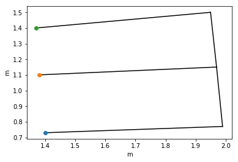
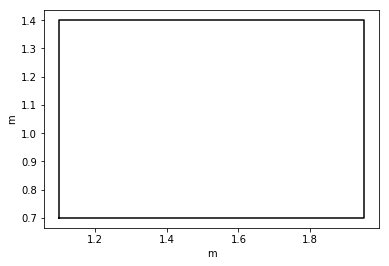

# ndx-maze Extension for NWB:N
This is a Neurodata Extension (NDX) for Neurodata Without Borders: Neurophysiology (NWB:N) 2.0 for representing the spatial structure of the environment (mazes, boxes, etc.).

Developed in the Frank Lab with minor alterations.

## python
### Installation
```bash
pip install git+https://github.com/ben-dichter-consulting/ndx-maze.git
```

### Usage

```python
from ndx_maze import Environments, Environment, PointNode, SegmentNode, PolygonNode, Edge
from ndx_maze.vis import show_environment

from pynwb import NWBFile
from datetime import datetime

sleep_box_polygon_coords = [[1.1, 0.7], [1.1, 1.4], [1.95, 1.4], [1.95, 0.7]]

wtrackA_segments = {'left_arm': [[1.4, 0.73], [1.99, 0.77]],
                    'left_branch': [[1.99, 0.77], [1.97, 1.15]],
                    'middle_arm': [[1.38, 1.1], [1.97, 1.15]],
                    'right_branch': [[1.97, 1.15], [1.95, 1.5]],
                    'right_arm': [[1.37, 1.4], [1.95, 1.5]]}

wtrackA_reward_wells = {'left_reward_well': [1.4, 0.73],
                        'middle_reward_well': [1.38, 1.1],
                        'right_reward_well': [1.37, 1.4]}

edge_pairs = [('left_arm', 'left_branch'),
              ('left_branch', 'middle_arm'),
              ('middle_arm', 'right_branch'),
              ('right_branch', 'right_arm'),
              ('left_branch', 'right_branch'),
              ('right_branch', 'right_reward_well'),
              ('left_branch', 'left_reward_well'),
              ('middle_branch', 'middle_reward_well')]

segments = [SegmentNode(name=key, coords=val)
            for key, val in wtrackA_segments.items()]

points = [PointNode(name=key, coords=[val])
          for key, val in wtrackA_reward_wells.items()]

w_maze = Environment(
    name='w_maze',
    edges=[Edge(name=n[0] + '<->' + n[1], edge_nodes=n) for n in edge_pairs],
    nodes=segments+points)

sleep_box = Environment(
    name='sleep_box',
    nodes=[
        PolygonNode(
            name='sleep_box',
            coords=sleep_box_polygon_coords
        )
    ]
)

show_environment(w_maze)
show_environment(sleep_box)

environments = Environments(name='environments', environments=[w_maze, sleep_box])

session_start_time = datetime.now().astimezone()
nwb = NWBFile('session_description', 'identifier', session_start_time)

nwb.add_lab_meta_data(environments)
```






## MATLAB:
### Installation
```bash
git clone https://github.com/bendichter/ndx-maze.git
```
```matlab
generateExtension('path/to/ndx-maze/spec');
```
